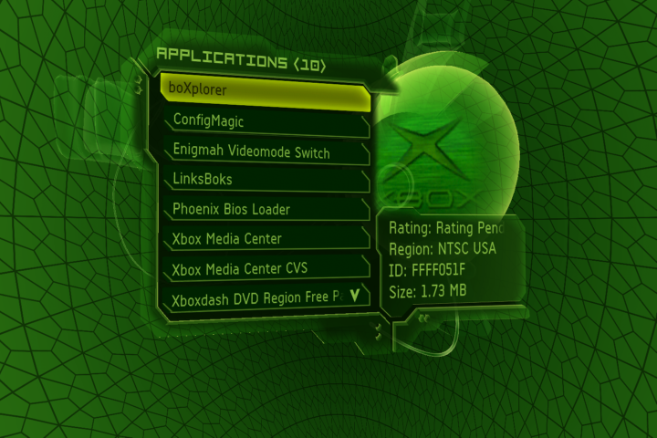
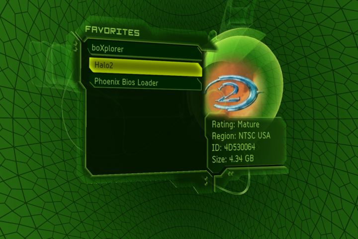
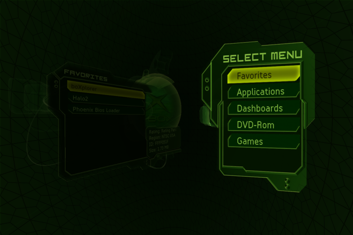
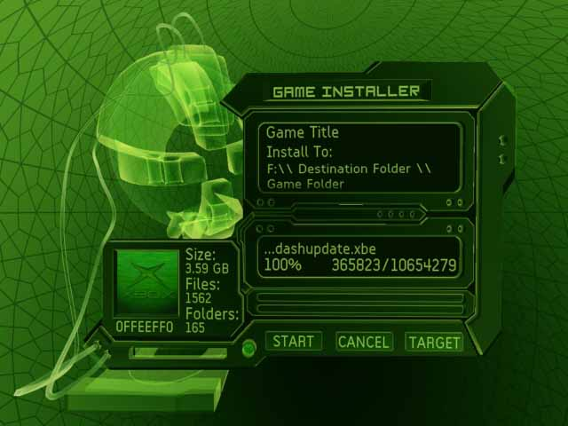
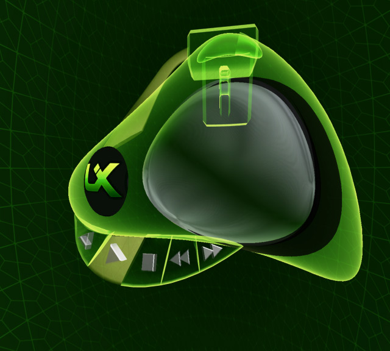

# UIX2: The Dashboard That Never Released

JbOnE's unreleased sequel to User.Interface.X. These screenshots survived in headph0ne's (Burner0) archive.

UIX2 was version 2.0 of User.Interface.X -- same codebase, same engine that grew out of JbOnE's XboxDash.NeT work. By the time it was being built (2005-2006), the Xbox 360 had been announced and the original Xbox was approaching end of life. Other dashboards like UnleashX and XBMC already handled game launching, disc ripping, and media playback. UIX2's pitch wasn't doing it first -- it was doing it all inside Microsoft's dashboard. One app, Microsoft's 3D engine, fully skinnable.

## The Game Browser

*APPLICATIONS (10 items): boXplorer, ConfigMagic, Enigmah Videomode Switch, LinksBoks, Phoenix Bios Loader, Xbox Media Center, Xbox Media Center CVS, Xboxdash DVD Region Free. Each entry shows Rating, Region, Title ID, and file size.*

*FAVORITES: boXplorer, Halo2, Phoenix Bios Loader. The Halo 2 entry displays actual game cover art loaded as a texture, with full metadata -- Rating: Mature, Region: 4D53006H, Size: 4.34 GB.*

*SELECT MENU with categorization: Favorites, Applications, Dashboards, DVD-Rom, Games. Separating games from apps from dashboards -- other community dashboards did this too, but UIX2 did it without leaving Microsoft's engine.*

## The Game Installer

*GAME INSTALLER: Disc-to-HDD installation built into the dashboard. Game Title, destination path, file size (3.59 GB), file count (1562 files, 165 folders), progress bar. DVD2Xbox and other tools already handled disc ripping -- JbOnE wanted it inside the MS dashboard so you never had to leave.*

## The Media Player

*A custom media player with the UIX logo on the orb, video display, and 3D transport control buttons (play, pause, stop, skip, rewind/fast-forward). The triangular player with molded buttons was fully modeled 3D geometry, not flat UI. XBMC was already the media player of choice -- this was about having it inside the dashboard's own engine.*

## What Happened

UIX2 was shelved after beta builds leaked internally. Unfinished code got passed around, modified by people who didn't fully understand it, and released as standalone dashboards. The leaked builds were often broken -- half-working features, crashes, missing assets -- and the people who installed them would show up in TeamUIX's channels looking for help with software the team hadn't released. Debugging someone else's butchered version of your own unfinished code is a special kind of frustrating. It killed the motivation to continue.

The screenshots and partial builds survived because headph0ne kept an archive -- he had leaked builds too, but he knew where everything came from and could tell the development builds from the mangled ones floating around the scene. Some of those builds were what Mattie, ILTB, and Odb718 were playing with at the time. Dig through the archive and you'll find different menu layouts people were experimenting with -- including Odb718 trying to recreate the Halo 2 menu inside the Xbox dashboard for reasons only he can explain.

Features from UIX2's design -- categorized game browsing, metadata display, favorites -- eventually made their way into UIX Lite years later through the community's XAP scripting work, rebuilt from scratch on the retail 5960 dashboard.
