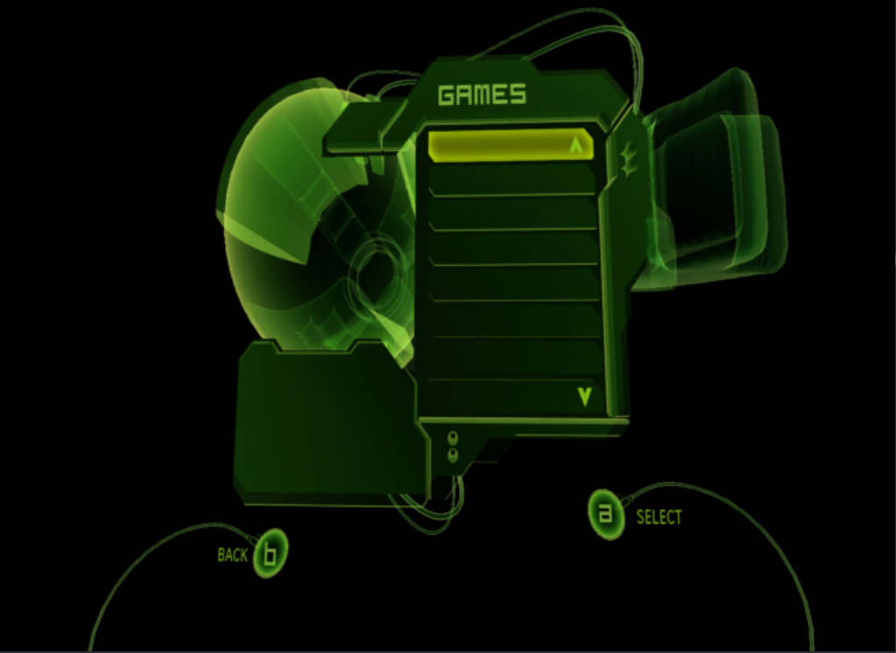

# Xbox Dashboard Architecture

## The Xbox as a PC

The original Xbox (2001) was, at its core, a PC:

| Component | Xbox | PC Equivalent |
|-----------|------|---------------|
| CPU | 733 MHz Intel Pentium III (Coppermine) | Standard x86 |
| GPU | NVIDIA NV2A (custom GeForce 3) | GeForce 3 Ti |
| RAM | 64 MB unified (shared CPU/GPU) | DDR SDRAM |
| Storage | 8-10 GB IDE hard drive | Standard ATA |
| OS | Windows 2000 kernel (NT 5.0) | Win2K stripped down |
| Graphics API | Direct3D 8 | Same as PC D3D8 |
| Audio | NVIDIA MCPX (AC'97 + custom DSP) | DirectSound on custom hardware |
| Network | 100 Mbit Ethernet | Standard NIC |

This is important because it means the dashboard was compiled with the same tools (Visual C++), using the same APIs (Win32 + DirectX), running on the same CPU architecture (x86). The Xbox kernel was a stripped-down NT kernel with Xbox-specific extensions; not a completely foreign OS.

## How Xbox Applications Work

The Xbox is a single-application system. There's no desktop, no task manager, no multitasking. At any given moment, exactly one application is running: a game, the dashboard, or a media player. That application *is* the user experience.

The core kernel lives in the BIOS (flash ROM). It's a stripped-down Windows 2000 kernel that provides the basics: memory management, filesystem, threading, hardware abstraction. But it doesn't provide a full operating system. There's no shell, no window manager, no system UI layer.

Every Xbox application, including the dashboard, is compiled with static libraries that provide the "rest" of the OS. The XDK (Xbox Development Kit) ships libraries for Direct3D, DirectSound, XInput, networking, Xbox Live, and the kernel API surface. When an application is compiled, it links against these libraries and ships as a self-contained `.xbe` executable that, together with the kernel, forms a complete running system.

In the simplest terms: **every Xbox application completes the OS.** The kernel provides the foundation, and the application brings everything else: graphics, audio, input handling, UI, networking. There's no shared graphics subsystem the way Windows has. Each app includes its own. When you launch a game, the dashboard exits entirely and the game takes over the full machine. When you return to the dashboard, it boots fresh.

This is why the dashboard has a full D3D8 rendering pipeline, its own audio subsystem, its own input polling, its own filesystem navigation. It can't rely on OS-provided UI services because there aren't any.

The irony of the desktop port: on Xbox, the dashboard had to bring its own everything because the OS didn't provide it. On desktop, there *is* a full OS with graphics, audio, input, and filesystem services, but the dashboard doesn't know how to use any of them. So the platform layer does the opposite of what the Xbox required: instead of the app completing the OS, the OS pretends to be the bare-metal hardware the app expects. The dashboard thinks it's still running alone on an Xbox, while SDL2, OpenGL, and the host filesystem quietly handle everything underneath.

## A Game Disguised as a Menu

The Xbox dashboard was designed by [Seton Kim](https://setonkim.com/xboxdashboard) at creative agency REZN8. The pitch was to "demonstrate an other worldly technology behind the console's power." Kim's concept art featured things like Hello Kitty trapped in an alien pod -- and traces of pop culture references and placeholder names from the design process survived all the way into the XIP archives, sitting in alpha builds that the community found years later.

The dashboard wasn't a simple menu screen. Microsoft built it as a hardware showcase -- a full 3D application using the same rendering techniques, shader effects, and audio systems that games used. The radial falloff lighting, animated 3D backgrounds, particle fields, real-time mesh rendering, and custom vertex shaders were all there to demonstrate what the NV2A could do. When you booted your Xbox for the first time and saw that glowing green orb with panels floating in 3D space, you were looking at a tech demo that happened to also let you manage your game saves.

The dashboard also had unusually deep system access. The precompiled header includes NT kernel headers directly -- `ntos.h`, `ntdddisk.h`, `ntddcdrm.h`, `smcdef.h`, `av.h`. This wasn't a sandboxed user-mode app. The dashboard could talk to the kernel, the SCSI driver, the System Management Controller (for temperature, fan speed, LED control), and the AV output hardware. It was the closest thing the Xbox had to a system shell, and Microsoft gave it the keys to everything.

This is why decompiling it was interesting and why porting it is non-trivial: it's not a flat 2D UI. It's a scene graph with cameras, 3D transforms, materials, vertex shaders, and a scripting engine controlling all of it, running with kernel-level hardware access. The same tools and techniques that built Xbox games built the dashboard -- and then some.

## Boot Sequence

1. **BIOS/MCPX ROM** boots the system, verifies the kernel signature
2. **Xbox kernel** (`xboxkrnl.exe`) loads from flash, a modified NT 5.0 kernel
3. Kernel mounts the hard drive partitions (internal device paths like `\Device\Harddisk0\partition1\`)
4. Kernel launches the dashboard executable, mapping `y:\` as its application root
5. Dashboard loads its XIP archives from `y:\` (early versions) or `y:\xboxdashdata.{version}\` (later versions) and begins rendering

## The Dashboard Application

The dashboard XBE is a D3D8 application with a main loop:

```
Initialize:
  1. Set up D3D8 device (640x480, interlaced or progressive)
  2. Load default.xip (the root archive)
  3. Parse default.xap (the root scene script)
  4. Build the scene graph from parsed nodes
  5. Initialize audio, network, input

Main Loop (60fps):
  1. Advance(): Update animations, timers, input state
  2. Draw(): Traverse scene graph, render each visible node
  3. Present(): Flip the backbuffer to the display
```

### CDashApp: The Singleton

The entire application is managed by a global singleton `CDashApp` (originally `CXApp`). It owns:
- The D3D8 device and presentation parameters
- The root scene node
- Frame timing (`m_dwStartTick`, `m_dwFrameTick`)
- Configuration state (video mode, dashboard settings)
- Title ID of the currently running context

Every D3D8 call in the codebase goes through `CDashApp` wrapper functions:
```cpp
DashAppSetRenderState(D3DRS_LIGHTING, FALSE);
DashAppSetTexture(0, pTexture);
DashAppCreateVertexBuffer(size, usage, fvf, pool, &pVB);
```

This indirection is what made the desktop port possible. These wrappers could be redirected to OpenGL without changing every call site.

## Direct3D 8 Rendering

The Xbox GPU (NV2A) was a superset of DirectX 8.1 with some Xbox-specific extensions. The dashboard used:

### Vertex Processing
- **Fixed-function pipeline** for most UI elements (transformed & lit vertices)
- **Custom vertex shaders** for special effects (falloff lighting, glow, motion blur)
- Vertex formats defined with FVF (Flexible Vertex Format) codes:
  ```
  D3DFVF_XYZ | D3DFVF_NORMAL | D3DFVF_TEX1    // Position + Normal + UV
  D3DFVF_XYZ | D3DFVF_DIFFUSE | D3DFVF_TEX1    // Position + Color + UV
  D3DFVF_NORMPACKED3                             // Xbox-specific packed normals
  ```

### Texture Stage States
D3D8 used a multi-stage texture blending model (not shaders). The dashboard typically used:
- **Stage 0**: Base texture with modulate blending
- **Stage 1**: Optional lightmap or detail texture
- Color and alpha operations configured per-stage:
  ```
  SetTextureStageState(0, D3DTSS_COLOROP, D3DTOP_MODULATE);
  SetTextureStageState(0, D3DTSS_COLORARG1, D3DTA_TEXTURE);
  SetTextureStageState(0, D3DTSS_COLORARG2, D3DTA_DIFFUSE);
  ```

### The Falloff Shader

The dashboard's signature visual effect is a radial falloff: objects near the center of attention are bright, and objects further away fade to dark. This is implemented as a per-vertex lighting effect:

On Xbox, this was a custom vertex shader (`effect.vsh`) that computed a distance-based attenuation in hardware. On the desktop, this is approximated in CPU with the same math applied during vertex transformation.

### Render States

Key render states the dashboard manipulates:
- `D3DRS_LIGHTING`: Per-vertex lighting on/off
- `D3DRS_ALPHABLENDENABLE`: Transparency
- `D3DRS_SRCBLEND` / `D3DRS_DESTBLEND`: Blend modes (usually SrcAlpha/InvSrcAlpha)
- `D3DRS_CULLMODE`: Back-face culling
- `D3DRS_ZENABLE`: Z-buffer

## Input System

The Xbox used XInput for gamepad input, supporting up to 4 controllers. The original Xbox controller ("The Duke") had hardware that modern controllers don't:

- **Pressure-sensitive face buttons**: A, B, X, Y, Black, and White were analog (0-255), not digital. The dashboard used a threshold of 32/255 to determine "pressed."
- Two analog sticks (16-bit signed X/Y) with a massive dead zone (0.9) because early Duke controllers had poor centering
- Two analog triggers (8-bit unsigned, also reported as analog buttons)
- Digital buttons: D-pad, Start, Back, left/right thumbstick click
- Two memory unit slots per controller port
- Optional DVD remote kit with IR receiver dongle

The dashboard's `CJoystick` node looped over all 4 controller ports each frame, polling via `XInputGetState()`. It handled both gamepads and IR remotes (using an extended `XINPUT_STATE_INTERNAL` struct with key codes and timing for typomatic repeat). Button state changes fired XAP callbacks: `OnADown`, `OnMoveUp`, `OnReverse`, `OnPlay`, etc. The XAP scripts never dealt with raw input -- they received named events.

## Audio

The Xbox had a custom audio DSP (the MCPX) accessed through DirectSound. The dashboard used:
- **DirectSound buffers**: UI sounds (button clicks, transitions)
- **WMA decoding**: Background music and ripped CDs
- **IMA ADPCM**: Compressed audio in XIP archives
- **CDDA**: Audio CD playback from the DVD drive

## Filesystem

### How Retail Xbox Addresses Storage

The Xbox kernel doesn't use drive letters. It addresses partitions internally as device paths: `\Device\Harddisk0\partition1\`, `\Device\Harddisk0\partition2\`, etc. The retail dashboard was given `y:\` as its application root, which the kernel mapped to the appropriate internal path.

The filesystem layout evolved across dashboard versions:

- **Early dashboard versions** (launch era): Everything lived directly under `y:\`. The dashboard loaded `y:\default.xip`, `y:\default.xap`, and all assets from the `y:\` root. Simple and flat.
- **Later versions** (Xbox Live era, up through 5960): Microsoft reorganized into a versioned subfolder structure: `y:\xboxdashdata.185ead00\`. This kept dashboard data separated as updates shipped. The `fffe0000` title ID was used for dashboard-owned user data under `\Device\Harddisk0\partition1\TDATA\fffe0000\`.

Theseus was reverse-engineered from all of these versions, so the codebase needed to understand both the early flat layout and the later organized structure.

### Scene Drive Letter Conventions

The familiar `C:\`, `E:\`, `F:\` drive letter scheme does not come from Microsoft. It's a modding scene convention introduced by custom BIOSes and dashboards (UnleashX, XBMC, EvolutionX, etc.) that maps the kernel's internal partition paths to letters for convenience.

In the modded ecosystem that Theseus targets:

| Drive | Content | Origin |
|-------|---------|--------|
| `C:\` | System files, dashboard XBE, fonts | Scene convention |
| `D:\` | DVD-ROM (current disc) | Scene convention |
| `E:\` | User data: game saves, soundtracks, DLC | Scene convention |
| `F:\` | Extended storage (partition 6) | Scene convention (first extended partition) |
| `G:\` | Extended storage (partition 7) | Scene convention |
| `Q:\` | Dashboard system folder mapping | Theseus/UIX Lite (similar to XBMC's approach) |
| `H:` - `N:` | Partitions 8-14 | Cerbios and Titan BIOSes |

The `Q:\` mapping is not an Xbox standard. It was implemented in Theseus (similar to how XBMC mapped its own system folder to a drive letter) to give the dashboard a consistent path for XIPs, skins, fonts, and configuration files.

### File I/O

Regardless of how paths are mapped, all file I/O used standard Win32 APIs: `CreateFile`, `ReadFile`, `WriteFile`, `FindFirstFile`, `FindNextFile`, `GetFileAttributes`. These are the same APIs available on Windows, which is both a blessing (familiar) and a curse (the desktop port has to intercept them to redirect to the virtual filesystem).

## Network

The Xbox had a built-in 100 Mbit Ethernet port. The dashboard used:
- **XNet** (`XNetStartup`, `XNetGetConfigStatus`, etc.) and **WinSock** (Xbox variant) for TCP/UDP networking
- **Xbox Live** APIs (`XOnline*`) for online services
- Custom FTP server for file management (added by Theseus/UIX Lite Toolbox)

Network initialization happened at boot. The dashboard detected cable connection, obtained an IP via DHCP (or used a static config), and started network services.

## Things People Get Wrong

### "The Xbox Uses Drive Letters C: E: F:"

No it doesn't. The Xbox kernel addresses partitions as NT device paths: `\Device\Harddisk0\partition1\`, `\Device\Harddisk0\partition2\`, etc. Microsoft's own dashboard code (in `Xbox.cpp`) only mapped THREE drive letters -- `C:` (system), `Y:` (dashboard data), and `T:` (dashboard title data) -- using `IoCreateSymbolicLink` to create NT symbolic links at boot. That's it. No `E:`, no `F:`, no game partition letters.

The `C:\`, `E:\`, `F:\`-`N:\` drive letter scheme that everyone associates with Xbox modding came from custom BIOSes and alternative dashboards (UnleashX, XBMC, EvolutionX). The modding scene created the convention and it stuck so hard that people assume Microsoft did it.

### "The Falloff Effect Is a Pixel Shader"

It's not even a D3D vertex shader. It's raw NV2A GPU microcode -- hand-written instruction words compiled into C header files as DWORD arrays:

```c
DWORD dwEffectVertexShader[] = {
    0x00152078,
    0x00000000, 0x00ec001b, 0x0836186c, 0x20708800,
    0x00000000, 0x00ed401b, 0x0836186c, 0x28200ff8,
    // ... 21 GPU instructions
};
```

These are direct NV2A instruction words -- not HLSL, not assembly, not D3D shader bytecode. Microsoft wrote the dashboard's signature lighting effect in GPU machine code. There are five variants (`effect.h` through `effect4.h` plus `aniso.h`) for different vertex formats and material types. On desktop, this is all replaced by a GLSL vertex shader that does the same math.

### "The Dashboard Is Basically a Menu"

The retail `default.xap` defines ambient industrial soundscapes with randomized timing:

```vrml
PeriodicAudioGroup {
    period 60
    periodNoise 20  // random 0-20 seconds added
    children [
        AudioClip { url "Audio/AmbientAudio/AMB_EC_Steam1.wav" volume 0.80 }
        AudioClip { url "Audio/AmbientAudio/AMB_EC_Steam2.wav" volume 0.80 }
        // ... 7 steam hiss variants
    ]
}

PeriodicAudioGroup {
    period 120
    periodNoise 30
    children [
        AudioClip { url "Audio/AmbientAudio/AMB_EC_Voices1.wav" volume 0.80 }
        // ... distant voice clips
    ]
}
```

The dashboard randomly plays steam hisses every 60-80 seconds and distant voices every 120-150 seconds. It has ambient background music per section (`AMB_12_HYDROTHUNDER` for the main menu). The whole thing is designed like a game level, because that's what Microsoft's dashboard team was building -- a tech demo that happened to have system settings.

### "The Dashboard Was Never Meant to Launch Games"

It was. Alpha XIP archives contain a fully designed "GAMES" menu with scroll arrows, a list panel, and selection UI. Someone at Microsoft built a game launcher into the dashboard scripts and it got cut before retail. The TitleMeta.xbx format in alpha builds had fields for publisher names and high scores -- a richer game info system was planned.


*A "GAMES" browser found in pre-release XIP archives. Microsoft had the concept and chose not to ship it.*

The community spent years reimplementing this exact feature in XAP script (`harddrive.xap`), not knowing Microsoft had already built and scrapped it. When these alpha XIPs surfaced, the community could hand-translate the scripts and see what Microsoft had planned -- and how close their own hacked-together solutions had gotten to the original design.

### "XBX Files Are Textures"

Usually, but not always. Microsoft reused the `.xbx` extension for plain UTF-16LE text files containing save game metadata (`TitleMeta.xbx`, `SaveMeta.xbx`). These have no XPR0 header, no DXT compression, no swizzling. They're just text with a misleading extension. The dashboard's code checks the file content, not the extension, to determine what it's looking at. This inconsistency is part of why the unsigned `.xbx` metadata files became an early vector for console modification.

### "Microsoft's Code Was Clean"

From `DSound.cpp`:
```c
//
// BUGBUG: copied from disc.cpp
//
```

From `xapp.h`:
```c
// ...the really proper fix would be to represent
// time using a DWORD, and convert to floating point after computing an
// age, but we don't have time to do that...
typedef double XTIME;
```

The Xbox shipped in 2001. The dashboard team was under deadline pressure like everyone else. The code has TODOs, BUGBUGs, copy-paste admissions, and the kind of pragmatic shortcuts you'd expect from a team shipping a launch title on a new console. The `XTIME` comment is still in Theseus because it's still true -- nobody has had time to fix it, 25 years later.

## The Decompilation vs the Original

The Theseus engine (UIX-Lite-Rebase) is a reverse-engineered reconstruction of the Xbox dashboard XBE. The goal was accuracy -- make every XAP script in existence load and run correctly. That means the node tables, property names, and function signatures have to match what the original binary exposed.

### Node Tables: The Contract

The XAP scripts call node properties and functions by name. These tables must match exactly or scripts break. The decompilation recovered them from string references in the binary (`IMPLEMENT_NODE` macros embed type names as literals):

```cpp
// Reconstructed from the 5960 XBE:
IMPLEMENT_NODE("Joystick", CJoystick, CNode)
START_NODE_PROPS(CJoystick, CNode)
    NODE_PROP(pt_boolean, CJoystick, isBound)
    NODE_PROP(pt_number, CJoystick, frequency)
    NODE_PROP(pt_number, CJoystick, xaxis)
    NODE_PROP(pt_number, CJoystick, yaxis)
    // ...18 properties total
```

Every node class follows this pattern. The macro tables act like a manifest -- if the property names or order don't match the binary, scripts fail. Getting these right was the first milestone of the RE work.

### Drive Mapping: 3 Letters vs 10+

The retail dashboard mapped three drive letters at boot using NT kernel symbolic links: C (system partition), Y (dashboard data), T (title data). Three drives. That's all it needed.

Theseus maps the full modding scene convention:
```cpp
void Xbox_Init()
{
    IoCreateSymbolicLink(&qDrive, &uixsystem);   // Q: -> UIX system folder
    IoCreateSymbolicLink(&cDrive, &cPath);        // C: -> partition2
    IoCreateSymbolicLink(&dDrive, &dPath);        // D: -> CdRom0
    IoCreateSymbolicLink(&eDrive, &ePath);        // E: -> partition1
    IoCreateSymbolicLink(&fDrive, &fPath);        // F: -> partition6
    IoCreateSymbolicLink(&gDrive, &gPath);        // G: -> partition7
    IoCreateSymbolicLink(&xDrive, &xPath);        // X: -> partition5
    IoCreateSymbolicLink(&yDrive, &yPath);        // Y: -> partition4
    IoCreateSymbolicLink(&zDrive, &zPath);        // Z: -> partition3
    // ...plus Cerbios extended partitions H-N
}
```

Same kernel API, just more of it. This is what connects the XAP scripts (which reference `E:\Games\*`) to the actual hardware partitions.

### What Theseus Added

The retail dashboard had roughly 73 source files (based on the known class/subsystem count from RE). Theseus has 97. The additional files represent everything the community needed that Microsoft didn't build:

**New subsystems:**
- `Overlay.cpp` / `OverlayAlert.cpp` -- The UIX Lite scrollable overlay panel (system info, drive status, FTP)
- `Discord.cpp` -- Discord Rich Presence integration
- `TheseusLauncher.cpp` -- XBE game launching with extended partition support
- `TitleMenu.cpp` / `TitlesGrid.cpp` -- Game title browsing UI
- `Harddrive.cpp` -- Hard drive management features
- `Panel.cpp` -- Additional UI panel system

**Xbox Live reconstruction:**
- `XboxLive.cpp` / `LiveAccounts.cpp` / `LiveProfile.cpp` -- Xbox Live account management, rebuilt from the 5960 XBE for Insignia compatibility
- `xbNet.cpp` / `network.cpp` -- Network stack

**Hardware interaction:**
- `Modchip.cpp` -- Modchip detection and identification
- `XKEeprom.cpp` / `XKCRC.cpp` / `XKSHA1.cpp` / `XKRC4.cpp` / `XKUtils.cpp` / `XKGeneral.cpp` -- Xbox crypto and EEPROM utilities (the XK library)
- `DiscManager.cpp` -- Disc management for ISO extraction

**Utilities:**
- `xbe.cpp` -- XBE executable reader (title ID, icon extraction)
- `DSoundManager.cpp` -- DirectSound management wrapper
- `BitFont.cpp` -- Bitmap font rendering

### Standing on the Scene's Shoulders

Theseus wasn't built in isolation. The 24 new files drew from across the Xbox homebrew ecosystem -- open source projects that had solved specific problems years earlier:

- **The Q: drive convention** came from XBMP/XBMC (Xbox Media Center, before it became Kodi -- and yes, Plex was originally a macOS fork of XBMC). It made sense for the dashboard to have its own system folder mapping, and Q: was already established.
- **Networking** went through several iterations. neXgen's network stack was used before the right kernel APIs were figured out from the retail XBE decompilation.
- **The XK crypto library** (XKUtils, XKCRC, XKSHA1, XKRC4) came from [Team Assembly](https://github.com/OfficialTeamUIX/Team-Assembly-XKUtils-0.2) -- the community's standard Xbox EEPROM and crypto toolkit.
- **Rendering and file I/O patterns** were referenced from XBMC and earlier media player projects until the decompilation was far enough along to use Microsoft's actual API patterns.

TeamUIX [mirrors several of these projects](https://github.com/OfficialTeamUIX) for archival purposes -- Team Assembly's XKUtils, ConfigMagic, XKBaseApp, neXgen, PhoenixBiosLoader, TeamXOS (whose members later became Team Resurgent), and others. These aren't dependencies in the traditional sense. They're the collective knowledge of 20 years of Xbox homebrew that Theseus drew from at various points, sometimes for working code, sometimes just to understand the right approach.

### Config: Same Function, Different Implementation

Microsoft reads from a hardware EEPROM:
```cpp
int CConfig::GetAudioMode()
{
    DWORD dwFlags, dwType;
    VERIFY(!XQueryValue(XC_AUDIO_FLAGS, &dwType, &dwFlags, 4, NULL));
    switch (DSSPEAKER_BASIC(dwFlags)) {
    case DSSPEAKER_MONO:    return 0;
    case DSSPEAKER_STEREO:  return 1;
    default:                return 2;
    }
}
```

Theseus on Xbox does exactly the same thing -- it calls the same `XQueryValue` API to read the same EEPROM register. The function was reconstructed from the binary and it works identically. The XAP scripts call `theConfig.GetAudioMode()` and get back the same answer either way.

This is the Ship of Theseus in action: same function name, same parameters, same return values, same behavior. Reconstructed from the binary, not copied from the source. The planks look the same because the ship has to sail the same water.

## The XAP/XIP System

This is the heart of the dashboard and the reason the modding scene could reshape it without recompiling C++. See [XAP Script System](xap-scripting.md) and [XIP Archive Format](xip-format.md) for the full technical details.

In brief:
- **XAP**: Plain text scripts in VRML97 syntax (not "inspired by" -- literally VRML97, confirmed by Microsoft's `wrl2xm` converter in their build pipeline) with JavaScript-like scripting blocks for interactivity
- **XIP**: Binary archives (magic `"XIP0"`) containing XAP scripts, XBX textures, XM meshes, XTF fonts, and audio
- The dashboard loads `default.xip`, parses `default.xap` from it at runtime (text-to-bytecode compilation, not pre-compiled), and builds the entire UI from the script definitions
- Sub-scenes are loaded lazily via `Inline` nodes, only parsed when the user navigates to them
- Skins override textures and meshes by providing replacement files in `Q:\Skins\{name}\`

The fact that XAP files were compiled at load time from plain text is what made the modding scene possible. The community didn't need Microsoft's build tools to modify the UI. A text editor and an understanding of the node types was enough.
